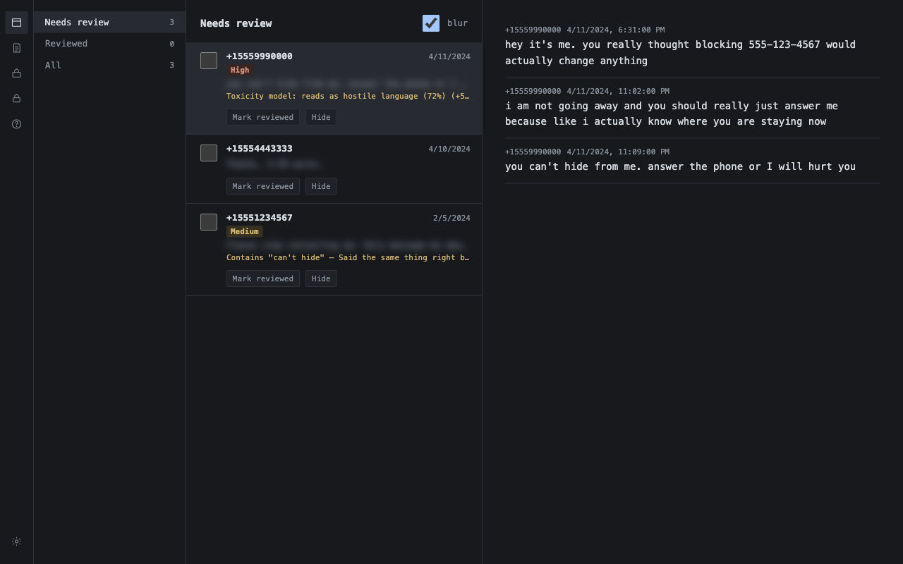
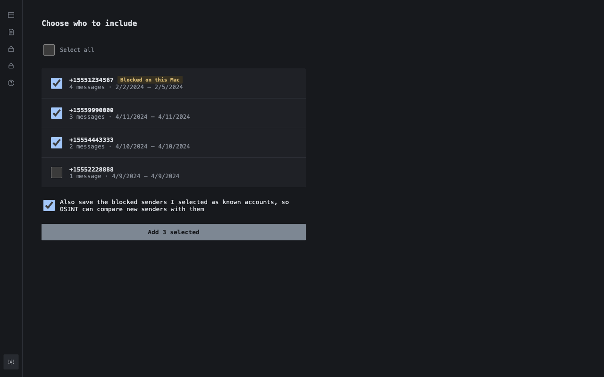
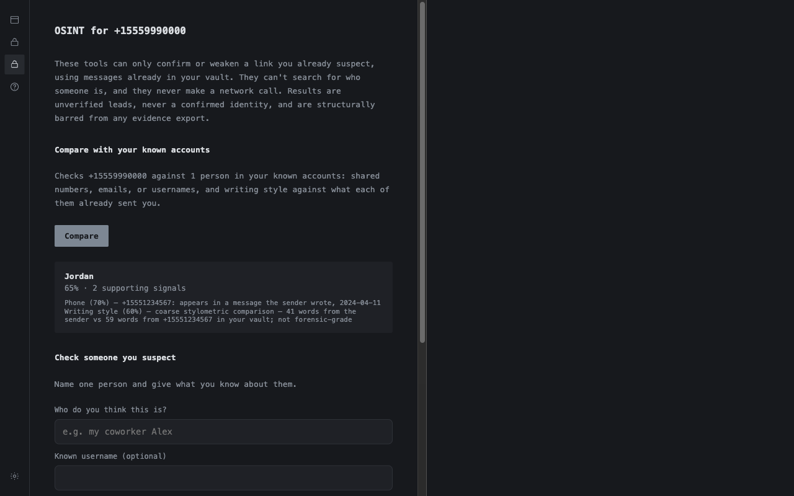

# docket

A free, local-first desktop tool for people being harassed by someone they
know — an ex, a coparent, a relative, a coworker. Triages harassing
messages, preserves evidence in a form that survives a chain-of-custody
challenge, and — gated, see below — attempts to identify a harasser from
public signals.

An informational site (not the app itself — the app runs entirely on your
own machine) is at **https://erikleon.github.io/docket/**, built
from `docs/`.



| Onboarding marks contacts you blocked | OSINT compares a new number with them |
| --- | --- |
|  |  |

Screenshots use made-up demo data; every label and reason in them is the
app's own, including the High label from the toxicity model.
`scripts/capture-screenshots.mjs`
rebuilds them from the real app, and `scripts/render-og-card.mjs` rebuilds
the link-preview card (`docs/og-image.png`).

The full plan, including 26 reviewed design decisions and an independent
adversarial critique, lives in `~/.claude/plans/2026-09-22-antistalker.md`.
Deferred and completed-since-the-plan work is tracked in `TODOS.md`, and
design decisions (the locked color/typography system, plus later ones like
the coerced-unlock stance) live in `DESIGN.md`.

## Status

Ingest (iMessage, Android SMS export, IMAP, Instagram export), the encrypted vault, and the
SCORE module (ONNX classifier + structural signal detectors) are built and
tested. The Electron app runs a real flow end to end:

- **Onboarding** (Settings → Connect) — a real wizard per source: connect,
  a metadata-only scan (no vault write yet), a "before you continue" screen
  naming how many senders were found, then a checkbox picker before
  anything is actually imported. Required fields are validated client-side
  before Scan is even clickable.
- **Triage** — buckets into Needs review / Reviewed / All, with keyboard
  power-navigation (arrow keys or j/k, Enter, r, h), per-row and batch
  hide/mark-reviewed, previews blurred by default (a real privacy shield,
  not just a toggle that does nothing), and a visible reason — not just a
  score — when a thread is flagged: the ONNX classifier for overt toxicity,
  or a structural signal (contact after a boundary you've marked, a tagged
  phrase, escalating frequency, a channel switch) for patterns that don't
  read as toxic on their own. Boundaries and tagged phrases are authored
  from Settings.
- **Vault auto-lock** — configurable inactivity timeout (default 15
  minutes, 0 disables it), plus a manual "Lock now."
- **Export, the OSINT gate, and remove-local-app-data** are real.
- **Toxicity model, on the device** — a 23 MB MiniLM model
  (`minuva/MiniLMv2-toxic-jigsaw-onnx`, Apache-2.0, pinned in
  `models/toxicity.json`) ships inside the installers and scores messages
  in the background after unlock and after every import. It flags threats
  and insults; swearing alone is discounted so friends aren't flagged. It
  does not catch polite-sounding coercion ("I know where you're staying
  now") — the pattern detectors and your boundaries are for that. Its
  label shows as the reason in triage, and Settings shows its status.
- **OSINT** — only for a sender the model (or an import-time score) put
  over the abuse threshold. On the device: compare with your known
  accounts, or check one candidate you name. Online, only on a click and
  after saying what it contacts: flag IP-logging, malicious, and phishing
  links in their messages (built-in lists offline; public lists
  downloaded and matched on the device — a link is never opened or sent),
  and check which of 19 named sites a username exists on. Every result is
  an unverified lead. `profile-photo-match` stays unbuilt — see TODOS.md.
- **Known accounts** — the accounts you know belong to someone
  harassing you, usually ones you blocked. Import them from this Mac's
  Messages block list or an Instagram export's block list, or type them
  in. Onboarding marks blocked senders and selects them first. OSINT
  compares a flagged sender with each person on the list: shared
  numbers, emails, or usernames, and writing style against what that
  person sent before you blocked them.
- **Incident log** — for what no message records: a visit, a call, a
  missed exchange, being followed. Rich text (minisiwyg-editor, with a
  narrow sanitizing policy), nothing deleted or overwritten (an update
  adds a revision and keeps the old text), and a typed time that falls on
  a clock change is asked about, never guessed (strictdatetime). Entries
  go into the evidence export under their own disclosure.
- **Instagram** — imports the JSON export from Instagram's "Download
  your information" (DMs and message requests). Unsent and deleted
  messages are not in that export.
- **No coerced-unlock / duress-passphrase mechanism**, deliberately — see
  DESIGN.md's "Coerced unlock" section for why a decoy vault or a duress
  wipe were both considered and turned down, and what the actual mitigation
  is instead (the panic-hide hotkey, disclosed plainly on the Support
  screen rather than left undiscovered until someone needs it).
- **Packaged installers** for macOS, Windows, and Linux — see "Installing a
  packaged release" below. They're unsigned (no paid signing certificate is
  wired up), so the OS shows a one-time warning on first launch.

## Installing a packaged release

Every tag pushed as `vX.Y.Z` builds a macOS `.dmg`, a Windows installer, and
a Linux `.AppImage` via `.github/workflows/release.yml`, and attaches them
to a matching GitHub Release. Grab the one for your OS from
[Releases](https://github.com/erikleon/docket/releases).

These builds are unsigned — nobody has paid for an Apple Developer ID or a
Windows code-signing certificate for this project. That means:

- **macOS**: Gatekeeper blocks the first launch ("can't be opened because
  Apple cannot check it for malicious software"). Right-click (or
  Control-click) the app in Finder and choose **Open**, then confirm — this
  only has to be done once.
- **Windows**: SmartScreen shows "Windows protected your PC." Click **More
  info**, then **Run anyway**.

Both warnings exist because the app isn't signed, not because of anything
specific it does. Building from source (below) sidesteps them entirely
since you're running code you compiled yourself.

The packaged app installs as **Notes** — a neutral name and icon so it
doesn't stand out on your device (D5 in the plan; see DESIGN.md). It's the
same app either way; the disguise is cosmetic, not a separate build.

To build a package yourself instead of downloading one: `npm run dist:mac`,
`npm run dist:win`, or `npm run dist:linux` (each only works from that OS —
this doesn't cross-compile). Output lands in `release/`.

## Setup

```
npm install
npm run typecheck
npm test
```

### Native modules

`better-sqlite3` (13 or later) and `onnxruntime-node` both use N-API, so
one prebuilt binary works under plain Node (`npm test`) and under
Electron (`npm start`, `npm run test:e2e`) with no rebuild step between
them. Electron 44 runs Node 24; use Node 24 locally too.

Newer npm versions ask before running a package's install scripts
(`npm install-scripts ls`). None are needed for development:
`better-sqlite3` ships prebuilt binaries for macOS, Windows, and Linux,
and Electron downloads its own binary the first time it runs.

### Pinned assets (toxicity model, WhatsMyName)

`npm test` and `npm run build` first run `npm run fetch-assets`, which
downloads the files each manifest in `models/` lists (the 23 MB toxicity
model from a pinned Hugging Face revision; the WhatsMyName site rules
from a pinned GitHub commit) into `models/<name>/` and checks each
file's SHA-256. It needs the network once; after that it's a no-op. The
files aren't committed. Installers bundle them, and the installed app
never downloads them.

## Structure

```
src/
  main/     Electron main process, IPC registration (OSINT handlers must
            register through registerGated, never registerHandler directly),
            vault session lifecycle, settings storage
  ingest/   Per-source adapters (imessage, android-sms, imap, instagram),
            the macOS block list reader (blocklist/), and quarantine
  vault/    Append-only store, encryption, credentials, integrity, destroy,
            export, plus the separate (mutable, non-evidentiary) stores:
            triage view-state, onboarding source config, and user-authored
            boundaries/tagged phrases for the structural detectors, and
            known accounts (the OSINT comparison baseline)
  score/    Local toxicity classifier, structural signal detection, summarizer
  triage/   Composes vault threads + view-state + fired signals into
            bucketed, banded rows for the UI
  pipeline/ Runs an ingest adapter against the vault, classifying each message
  osint/    The unlock gate, eligibility listing, evidence signals, ranking
  ui/       Static renderer assets (index.html, tokens.css, app.css)
  types/    Shared Message/RawRecord types
renderer/   Renderer TypeScript (compiled separately — browser ES modules,
            not the CommonJS main process build; see renderer/tsconfig.json).
            One file per screen under screens/ — lock, triage, onboarding,
            vault-export, osint, settings, boundaries, destroy, support.
docs/       The informational site above (GitHub Pages, served from here on
            main) — not part of the app; nothing in it runs on a user's device
build/      Packaging assets (icon.icns/.ico/.png, plus the .svg they're
            generated from) — read by electron-builder's config in
            package.json's "build" field, not by the app itself
test/
  unit/     Vitest
  e2e/      Playwright, drives the real compiled Electron app (dist/) —
            run `npm run build` first
qa-reports/ Test plans and dated /qa pass reports
```

## Design constraints worth knowing before touching this code

- Nothing in `ingest`, `score`, `vault`, or the triage UI ever makes a
  network call (IMAP talks to the user's own mail server, nothing else).
  Only `osint/network/` does, only from a click in the OSINT screen, and
  the screen says what it will contact before it runs. The renderer's
  CSP allows it no network at all; requests go from the main process.
- The vault has no delete method anywhere in its API. "Hide" is a UI-only
  view-state flag.
- The OSINT gate (`osint/unlock.ts`) is friction against casual misuse, not
  verification of anything. Its output can never enter an evidentiary
  export or be presented as a confirmed identity.
- No silent failures on ingest. A record that can't be parsed goes to
  quarantine, visibly, never a silent skip.
